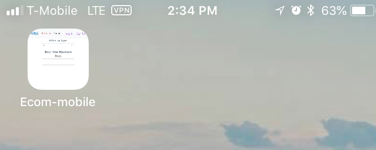

# Ecommerce Mobile
[Preface]
* This project allows my refactored version to become a PWA (Progressive Web App) . [Click here to check it out!](https://github.com/jgiler/ecom-refactor)

[General Info]
* This version of the project still contains filters and easy navigation. The website was made using the Mongo Database on Atlas, Node JS, and React JS. The purpose of this project was to create a Progressive Web App for mobile phones to use. The manifest and service worker were the ingredients that made allowed this app to become a PWA.

## Technologies used
Project is created with:
* Mongo, NODE JS, REACT
* npm version: 6.11.3
* node version: 12.5.0
* MongoDB Atlas
* Bcrypt Encryption Protocol
* JWT
* Heroku
* Service Worker
* Manifest

## PWA on my home screen


## PWA used on my iphone


## LAUNCH 
To run this project, install it locally (by cloning it) using npm. Configure your .env file. Then follow the commands below: 
```
$ cd ecom-refactor
$ npm install
$ npm start
```

## License
[MIT](https://choosealicense.com/licenses/mit/)


